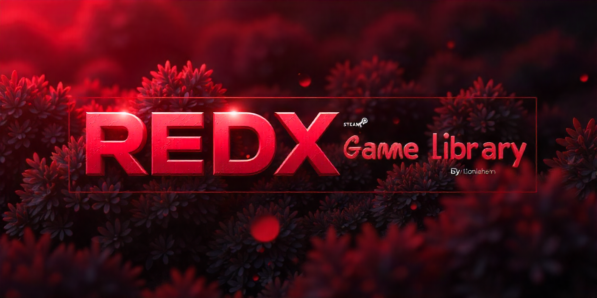

# 🎮 RedX Game Library

**Modern Steam Game Library and Manager**

  
  
  **A modern, multi-language Steam game library manager with an elegant red-black theme**

## 🌍 Language / Dil / Sprache / Язык / 言語

Choose your preferred language for documentation:

| Language | README |
|----------|--------|
| 🇹🇷 **Türkçe** | [README_TR.md](README_TR.md) |
| 🇺🇸 **English** | [README_EN.md](README_EN.md) |
| 🇩🇪 **Deutsch** | [README_DE.md](README_DE.md) |
| 🇷🇺 **Русский** | [README_RU.md](README_RU.md) |
| 🇯🇵 **日本語** | [README_JA.md](README_JA.md) |

## 🚀 Quick Start

1. Download the latest `RedXGameLibrary.exe` from [Releases](https://github.com/Scriptez1/RedXFreeSteamInstaller/releases/latest)
2. Double-click `RedXGameLibrary.exe` to run
3. No installation required!

## ✨ Key Features

- 🎨 **Modern UI** - Elegant red-black theme with smooth animations
- 🌍 **Multi-Language** - Support for 5 languages (TR, EN, DE, RU, JA)
- 🎮 **Game Management** - Search, filter, and manage Steam games
- 🔧 **Auto Updates** - Automatic update checking via GitHub
- 📱 **Responsive** - Adapts to different screen sizes
- 🔍 **Advanced Search** - Fast game search with genre filtering
- 💾 **Installation Tracking** - Monitor installed games and DLCs

## 📸 Screenshots

  
  
<em>Modern game library interface with red-black theme</em>

## 🛠️ Technology Stack

- **Frontend**: Python Tkinter with custom styling
- **Backend**: Python with Steam API integration
- **Languages**: Multi-language support system
- **Updates**: GitHub API integration
- **Platform**: Windows (Steam required)

## 📊 Project Stats

- **Languages Supported**: 5
- **Total Translations**: 70+ strings per language
- **File Structure**: Modular and organized
- **Update System**: Automated via GitHub

## 🤝 Contributing

We welcome contributions! Please see the language-specific README files for detailed contribution guidelines:

- [Turkish Contributors](README_TR.md#-katkıda-bulunma)
- [English Contributors](README_EN.md#-contributing)
- [German Contributors](README_DE.md#-mitwirken)
- [Russian Contributors](README_RU.md#-участие-в-разработке)
- [Japanese Contributors](README_JA.md#-貢献)

## 📋 System Requirements

| Component | Minimum | Recommended |
|-----------|---------|-------------|
| **OS** | Windows 10 | Windows 11 |
| **RAM** | 4 GB | 8 GB |
| **Storage** | 100 MB | 500 MB |
| **Internet** | Required | High-speed |

## 🔗 Links

- **GitHub Repository**: [RedXFreeSteamInstaller](https://github.com/Scriptez1/RedXFreeSteamInstaller)
- **Latest Release**: [Download](https://github.com/Scriptez1/RedXFreeSteamInstaller/releases/latest)
- **Report Issues**: [Issues](https://github.com/Scriptez1/RedXFreeSteamInstaller/issues)
- **Discussions**: [Discussions](https://github.com/Scriptez1/RedXFreeSteamInstaller/discussions)

## 📄 License

This project is licensed under the MIT License - see the [LICENSE](LICENSE) file for details.

## ⚠️ Disclaimer

This application is for educational purposes only. Please use it in accordance with Steam's Terms of Service and applicable laws in your jurisdiction.

## 🙏 Acknowledgments

- Steam API for game data
- Python community for excellent libraries
- Contributors and users for feedback and support
- Open source community for inspiration

---

  
<strong>RedX Game Library</strong> - Modern Steam Game Manager

  
Made with ❤️ by the RedX Team

  
  
  
  

